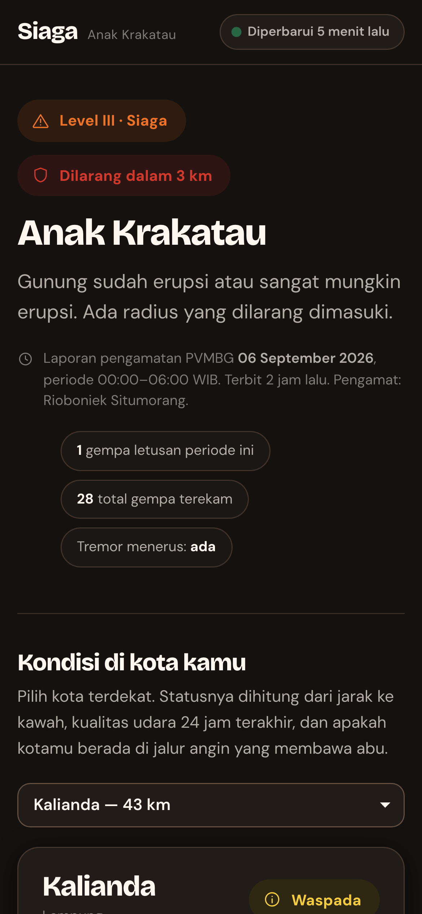
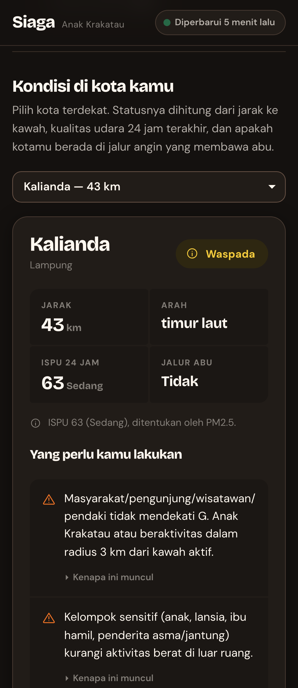
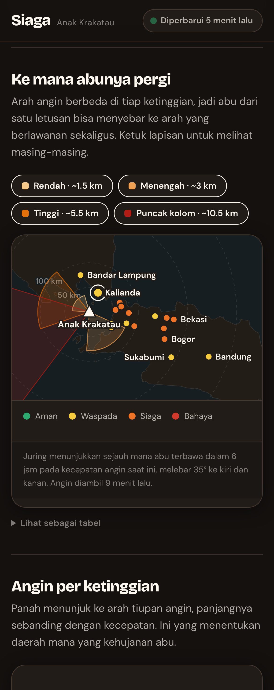
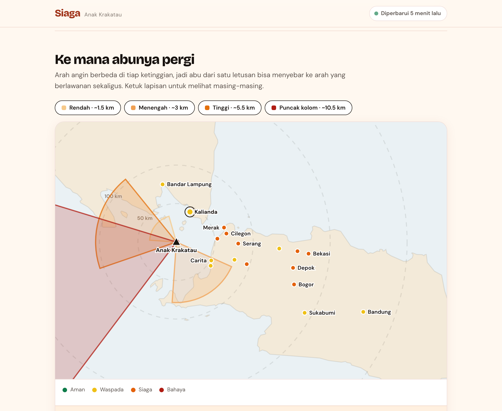
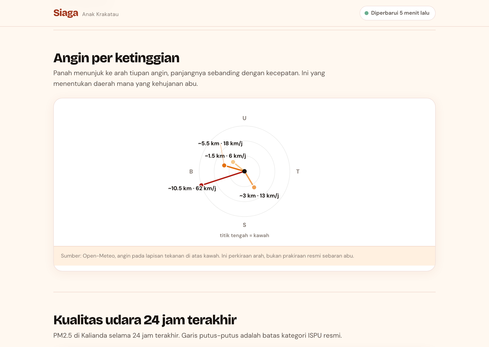
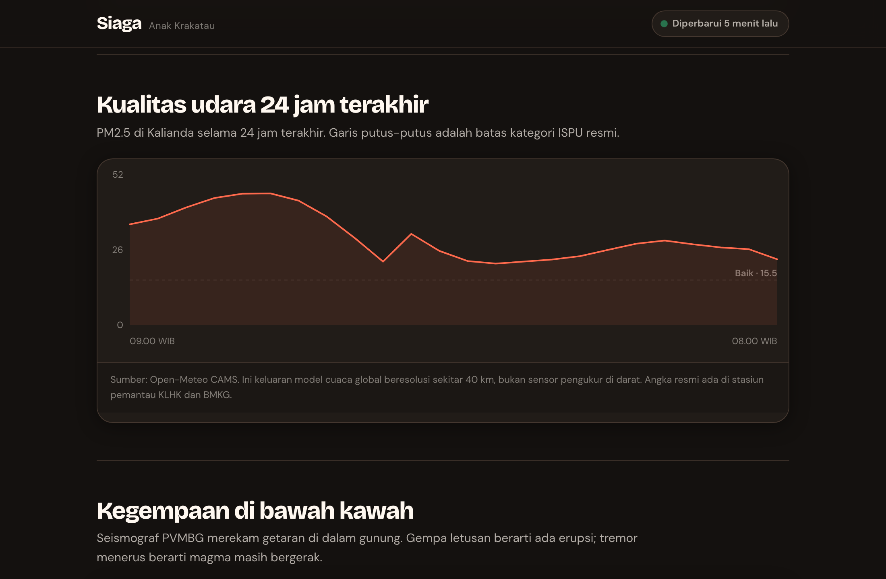
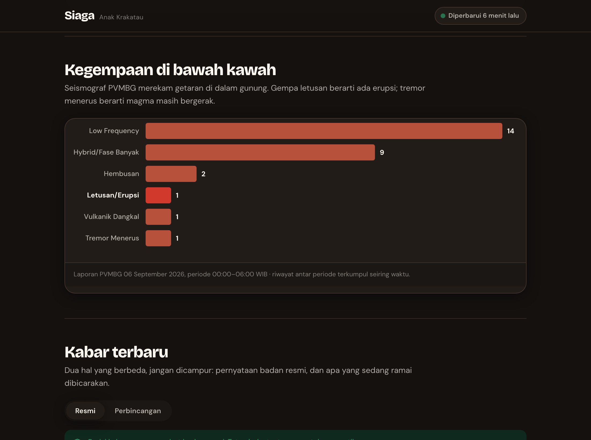
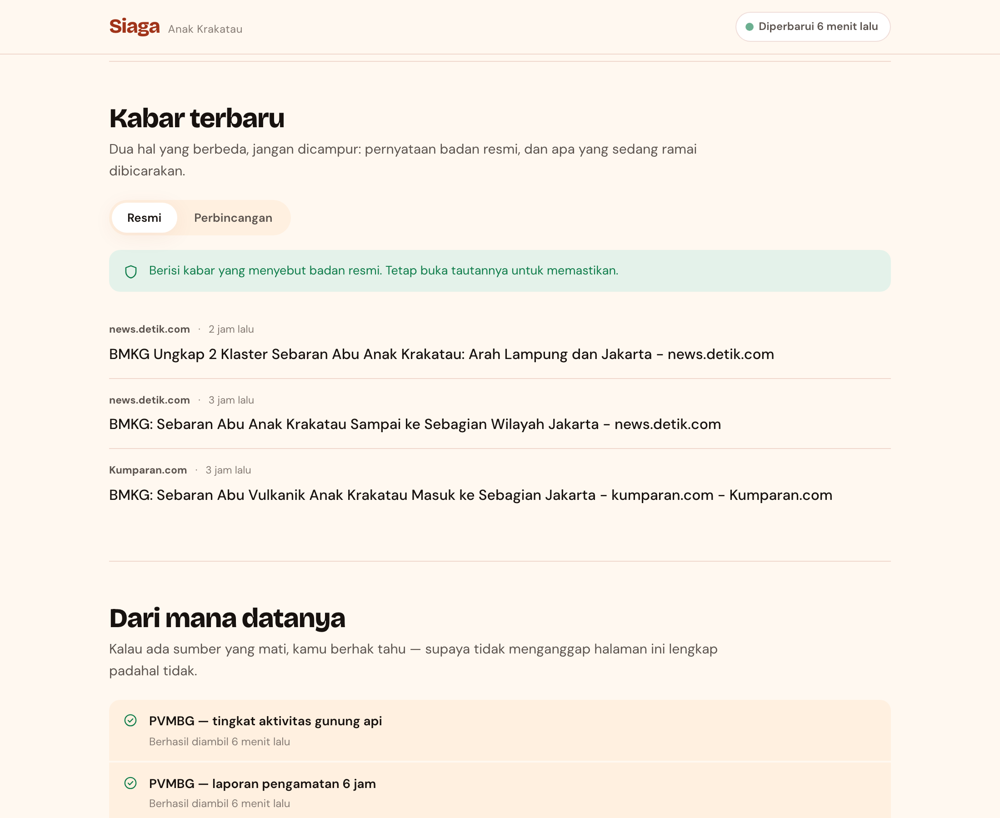
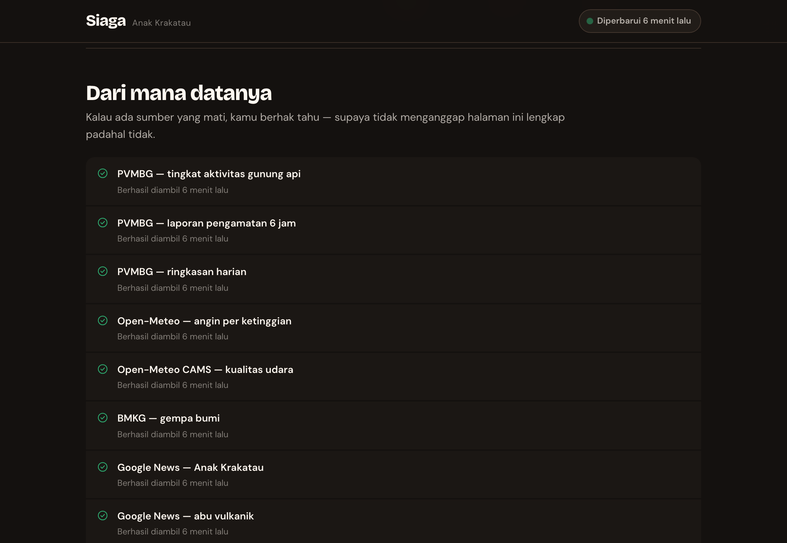
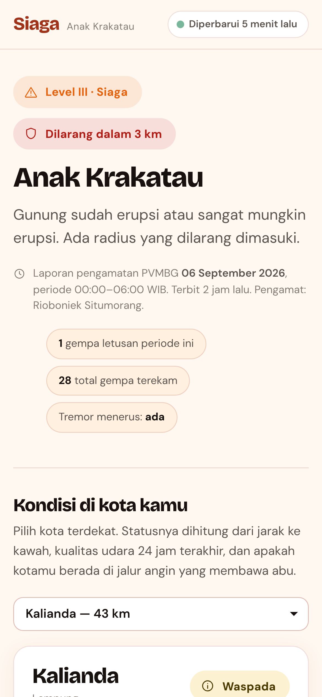

# Siaga

Satu halaman yang menjawab tiga pertanyaan saat gunung api sedang erupsi:
**apa yang terjadi sekarang, apakah kotaku terdampak, dan apa yang harus kulakukan.**

Dibuat karena pada erupsi Anak Krakatau September 2026, kabar dari unggahan warga
di media sosial beredar lebih cepat daripada pengumuman resmi — dan orang yang tidak
punya media sosial jadi tidak tahu apa-apa, padahal abu vulkanik berbahaya untuk
pernapasan dan mata.

Halaman ini menggabungkan **data resmi** (PVMBG, BMKG) dengan **perbincangan publik**
(berita, media sosial), memisahkan keduanya secara tegas, dan menempelkan **waktu**
pada setiap potong informasi supaya pembaca tahu apakah masih berlaku.

---

## Tampilan

| Vonis utama (gelap) | Kondisi kota kamu | Peta sebaran abu |
|---|---|---|
|  |  |  |

**Peta sebaran abu — desktop**



Juring menunjukkan sejauh mana abu terbawa dalam 6 jam pada kecepatan angin saat itu,
melebar 35° ke kiri dan kanan. Empat juring karena arah angin berbeda di tiap
ketinggian — abu di 3 km bisa ke tenggara sementara abu di 10 km ke barat. Titik kota
diwarnai menurut status, cincin putus-putus adalah jarak dari kawah.

**Angin per ketinggian**



**Kualitas udara 24 jam & kegempaan**

| Udara | Kegempaan |
|---|---|
|  |  |

**Kabar resmi vs perbincangan, dan kesehatan sumber**

| Kabar | Sumber |
|---|---|
|  |  |

Mode terang mengikuti pengaturan sistem pembaca:



---

## Sumber data

Semua ditarik di sisi server tiap 10 menit. Tidak ada satu pun yang butuh kunci berbayar.

| Sumber | Dipakai untuk | Cara ambil | Status |
|---|---|---|---|
| **MAGMA Indonesia / PVMBG** — [tingkat aktivitas](https://magma.esdm.go.id/v1/gunung-api/tingkat-aktivitas) | Level gunung (I–IV) seluruh gunung api | Baca HTML (server-rendered) | ✅ jalan |
| **MAGMA / PVMBG** — laporan pengamatan 6 jam | Visual, kegempaan per jenis, **rekomendasi resmi**, radius larangan | Baca HTML lewat tautan bertanda tangan dari tabel di atas | ✅ jalan |
| **MAGMA / PVMBG** — laporan harian | Ringkasan harian | Baca HTML | ✅ jalan |
| **BMKG** — [`autogempa.json`](https://data.bmkg.go.id/DataMKG/TEWS/autogempa.json) dll. | Gempa tektonik (dipisahkan dari gempa vulkanik) | JSON publik | ✅ jalan |
| **Open-Meteo Air Quality (CAMS)** | PM2.5 / PM10 / SO₂ per kota → ISPU | JSON publik | ✅ jalan |
| **Open-Meteo Forecast** | Angin pada 850/700/500/250 hPa di atas kawah | JSON publik | ✅ jalan |
| **Google News RSS (id)** | Kabar terbaru dari puluhan media | RSS | ✅ jalan |
| **X** — endpoint sematan `syndication.twitter.com` | Linimasa @infoBMKG, @BNPB_Indonesia, dll. | Baca `__NEXT_DATA__` | ⚠️ tergantung reputasi IP |
| **X** — pencarian kata kunci lewat Nitter | Unggahan warga | RSS instans Nitter | ⚠️ perlu whitelist, lihat di bawah |
| **Threads** | Unggahan warga | Threads Graph API | ❌ perlu App Review Meta, lihat di bawah |

Yang gagal **tidak disembunyikan**. Bagian "Dari mana datanya" di halaman menampilkan
status tiap sumber berikut pesan errornya, supaya pembaca tidak menganggap halaman
lengkap padahal tidak.

### Catatan jujur soal tiap sumber

**MAGMA tidak punya API publik tanpa token**, jadi halamannya yang dibaca. Kalau tata
letak MAGMA berubah, parser melempar error dan sumbernya ditandai gagal — bukan
menampilkan data lama diam-diam. Kalau pengambilan laporan gagal, halaman memakai
**laporan tersimpan terakhir** dan menyebutkan umurnya secara mencolok, sementara level
gunung tetap diambil dari tabel tingkat aktivitas (halaman terpisah, jadi jarang gagal
bersamaan). MAGMA sesekali membalas 403 saat ramai; ada satu kali coba ulang otomatis.
Kalau kamu punya token API MAGMA, jalur itu lebih stabil dan tinggal ditambahkan di
`src/sumber/magma.js`.

**Open-Meteo CAMS adalah keluaran model global beresolusi sekitar 40 km, bukan sensor
pengukur di darat.** Jakarta dan Bogor sering jatuh di sel model yang sama dan menunjukkan
angka identik. Ini ditulis apa adanya di halaman. Angka resmi ada di stasiun pemantau
KLHK dan BMKG.

**X:** endpoint sematan bekerja tanpa kunci tapi sensitif terhadap reputasi IP — dari IP
pusat data ia sering membalas 429, dari sambungan rumahan biasanya lolos. Untuk pencarian
kata kunci, instans Nitter (mis. `xcancel.com`) mengharuskan pembaca RSS di-whitelist:
panggil sekali, ambil ID dari pesan errornya di panel "Dari mana datanya", lalu kirim
surel ke alamat yang mereka sebutkan. Daftar instans ada di `config/config.json`.

**Threads:** Meta punya endpoint `keyword_search`, tapi **tanpa persetujuan App Review
untuk izin `threads_keyword_search`, endpoint itu hanya mengembalikan unggahan milik
pemilik token** — bukan unggahan publik. Jadi tanpa App Review kanal ini tidak berguna
untuk memantau perbincangan warga. Kodenya sudah ada dan tinggal diisi `THREADS_TOKEN`
kalau kamu sudah lolos review.

---

## Bagaimana kesimpulannya dihitung

**Tanpa LLM.** Semua status dan rekomendasi keluar dari aturan yang bisa dibaca dan
diperiksa di `src/analisa.js` dan `config/ambang.json`. Setiap langkah yang muncul di
halaman membawa **dasar** (aturan mana yang jalan) dan **sumber** (dari mana angkanya),
yang bisa dibuka pembaca lewat "Kenapa ini muncul".

### Status gunung

Langsung dari **level PVMBG**, tidak ditafsirkan ulang:

| Level | Nama | Status |
|---|---|---|
| I | Normal | aman |
| II | Waspada | waspada |
| III | Siaga | siaga |
| IV | Awas | bahaya |

### Status kota

Diambil yang **paling tinggi** dari tiga aturan:

1. **Zona larangan.** Radius dibaca dari teks rekomendasi PVMBG (`radius 3 km`), bukan
   angka karangan. Kota di dalam radius → **bahaya**. Kalau teksnya tidak menyebut radius,
   nilainya `null` dan aturan ini tidak jalan.
2. **Kualitas udara.** ISPU dihitung dari rata-rata bergerak 24 jam PM2.5/PM10/SO₂ dengan
   interpolasi linier antar titik patah **Permen LHK No. P.14/2020**, lalu diambil parameter
   dominan sesuai definisi ISPU. Baik → aman, Sedang → waspada, Tidak Sehat → siaga,
   Sangat Tidak Sehat & Berbahaya → bahaya.
3. **Jalur sebaran abu.** Kota dianggap di jalur kalau arahnya dari kawah berada dalam
   ±35° dari arah tiupan angin **di salah satu lapisan ketinggian** dan jaraknya di bawah
   400 km → minimal **waspada**.

Status gunung dan status kota **tidak dicampur**. Kota 250 km jauhnya dengan udara bersih
tidak jadi "siaga" hanya karena gunungnya Level III.

### Rekomendasi tindakan

Digabung dari empat asal, semuanya dikutip apa adanya:

- **Rekomendasi resmi PVMBG** dari laporan pengamatan — disalin verbatim, tidak diringkas.
- **Tindakan menurut kategori ISPU** — mengikuti Permen LHK P.14/2020 Lampiran III.
- **Tindakan khas abu vulkanik** — IVHHN dan Kemenkes (masker N95, kacamata bukan lensa
  kontak, tutup penampungan air, siram sebelum menyapu, jangan pakai wiper kering).
- **Aturan zona larangan** kalau kota berada di dalam radius.

Kalau data sumbernya tidak ada, keluarannya kosong — bukan diisi nilai default yang
kelihatan meyakinkan.

---

## Arsitektur

```
server.js              satu proses: berkas statis + /api/* + penjadwal
src/
  util.js              ambil HTTP (dengan satu coba ulang), parser HTML, jarak & arah bumi
  analisa.js           mesin aturan: ISPU, radius, jalur abu, status kota, rekomendasi
  db.js                skema SQLite + potret JSON
  kumpul.js            orkestrator: tarik semua sumber, hitung, tulis potret
  sumber/
    magma.js           PVMBG — tingkat aktivitas, laporan 6 jam, laporan harian
    bmkg.js            gempa tektonik
    cuaca.js           Open-Meteo — kualitas udara & angin per lapisan
    publik.js          Google News RSS, X (3 jalur), Threads
config/
  config.json          gunung yang dipantau, daftar kota, interval, sumber X
  ambang.json          titik patah ISPU, level PVMBG, teks tindakan — semua bersitasi
public/
  index.html           satu halaman, tanpa langkah build
  gaya.css             token Flavida + palet status
  app.js               peta SVG, kompas angin, grafik — vanilla, tanpa kerangka kerja
  coastline.json       garis pantai Selat Sunda, 7 KB (Natural Earth 10m, disederhanakan)
test.js                25 pemeriksaan mandiri, tanpa framework
scripts/
  tangkap.mjs          tangkapan layar README lewat CDP (alat pengembangan)
  garis-pantai.mjs     buat ulang coastline.json dari Natural Earth (sekali jalan)
```

**Nol dependensi npm.** Node 25 sudah membawa `fetch`, `node:sqlite`, `node:http`, dan
`WebSocket`. Tidak ada `npm install`, tidak ada rantai pasok yang perlu dijaga, dan
`docker build` hanya menyalin berkas. Halaman juga tanpa kerangka kerja dan tanpa langkah
build — peta dan grafik digambar sebagai SVG langsung.

### Kenapa JSON *dan* SQLite

Pertanyaan yang sering muncul, jadi ditulis alasannya:

- **Potret terkini → satu berkas JSON** (`data/terkini.json`). Dibaca utuh tiap permintaan,
  ditulis atomik lewat rename, dan bertahan saat proses dinyalakan ulang. Untuk data yang
  selalu dibaca seluruhnya, berkas tunggal lebih cepat dan lebih sederhana daripada kueri.
- **Riwayat → SQLite** (`data/siaga.db`). Tumbuh terus dan butuh kueri rentang waktu:
  laporan per periode, deret kualitas udara per kota, unggahan yang sudah pernah terlihat,
  dan riwayat kesehatan sumber. MAGMA hanya menampilkan laporan terbaru, jadi **tren
  kegempaan antar periode hanya ada kalau kita sendiri yang menyimpannya.**

Patokannya sederhana: kalau selalu dibaca utuh dan ukurannya tetap, pakai berkas. Kalau
tumbuh tanpa batas atau perlu disaring per rentang, pakai SQLite. Untuk skala ini,
Postgres tidak memberi apa pun selain satu layanan lagi yang harus dijaga.

---

## Menjalankan di homelab

### Docker Compose (paling ringkas)

```bash
git clone git@github.com:arnantoakbar/siaga.git
cd siaga
docker compose up -d --build
```

Buka `http://<ip-homelab>:8080`. Pengumpulan pertama jalan saat start dan makan sekitar
10–15 detik; sebelum selesai, `/api/terkini` membalas 503 dan halaman menampilkan keadaan
memuat.

```bash
docker compose logs -f siaga     # lihat sumber mana yang jalan / gagal
docker compose restart siaga
```

### Tanpa Docker

```bash
node --version    # butuh 24 atau lebih baru (node:sqlite bawaan)
node server.js
```

### systemd

```ini
# /etc/systemd/system/siaga.service
[Unit]
Description=Siaga
After=network-online.target

[Service]
Type=simple
User=siaga
WorkingDirectory=/opt/siaga
ExecStart=/usr/bin/node server.js
Environment=TZ=Asia/Jakarta
Environment=PORT=8080
Restart=always
RestartSec=10

[Install]
WantedBy=multi-user.target
```

```bash
sudo systemctl enable --now siaga
```

### Di balik reverse proxy

Caddy:

```
siaga.domainkamu.id {
    reverse_proxy localhost:8080
}
```

Nginx:

```nginx
server {
    server_name siaga.domainkamu.id;
    location / {
        proxy_pass http://127.0.0.1:8080;
        proxy_set_header Host $host;
        proxy_set_header X-Forwarded-For $proxy_add_x_forwarded_for;
    }
}
```

Layanan ini tidak butuh basis data eksternal, tidak menyimpan data pengunjung, dan tidak
memasang cookie. Satu-satunya yang disimpan di peramban adalah kota pilihan terakhir di
`localStorage`.

### Variabel lingkungan

| Nama | Bawaan | Arti |
|---|---|---|
| `PORT` | `8080` | Port dengar |
| `INTERVAL_MENIT` | `10` | Selang pengumpulan data |
| `TZ` | `Asia/Jakarta` | Zona waktu proses |
| `THREADS_TOKEN` | — | Token Threads (butuh App Review, lihat di atas) |

### Endpoint

| Endpoint | Isi |
|---|---|
| `GET /api/terkini` | Seluruh potret: status, kota, angin, kabar, kesehatan sumber |
| `GET /api/kesehatan` | Ringkas untuk pemantauan. Balas 503 kalau potret lebih tua dari 3× interval |
| `POST /api/segarkan` | Paksa pengumpulan ulang sekarang |

`/api/kesehatan` cocok dipakai Uptime Kuma atau healthcheck Docker.

---

## Konfigurasi

### Menambah kota

Tambahkan di `config/config.json`. Jarak dan arah dari kawah dihitung sendiri, tidak perlu
diisi:

```json
{ "id": "cilacap", "nama": "Cilacap", "provinsi": "Jawa Tengah", "lat": -7.727, "lon": 109.010 }
```

Kalau kota berada di luar kotak peta, geser `PETA` di `public/app.js` dan buat ulang
`public/coastline.json` dengan `node scripts/garis-pantai.mjs <barat> <selatan> <timur> <utara>`
(sumbernya Natural Earth `ne_10m_land`).

### Memantau gunung lain

Ubah `gunung` di `config/config.json` — `nama` harus persis seperti tertulis di tabel
tingkat aktivitas MAGMA (mis. `"Semeru"`, `"Merapi"`, `"Ibu"`). Sisanya jalan sendiri:
level, laporan, rekomendasi, angin, kualitas udara.

### Mengubah ambang

`config/ambang.json` memuat titik patah ISPU, pemetaan level, sektor toleransi sebaran abu,
dan seluruh teks tindakan. Tiap kelompok punya kunci `_sumber` yang menyebutkan asal
aturannya. **Kalau kamu mengubah angka di sini, ubah juga sitasinya** — supaya tidak ada
ambang tanpa dasar.

---

## Uji

```bash
node test.js
```

25 pemeriksaan, tanpa framework, fokus pada logika yang kalau salah membuat orang salah
mengambil keputusan: interpolasi ISPU di tiap titik patah resmi, pembacaan radius larangan
(termasuk kasus "tidak ada radius" yang harus menghasilkan `null`, bukan angka), sektor
sebaran abu saat menyeberang 0°, konversi WIB→UTC, dan satu regresi untuk bug yang pernah
terjadi: footer situs MAGMA sempat terbaca sebagai rekomendasi keselamatan.

---

## Catatan desain

Tampilan memakai **Flavida Design System** — Bricolage Grotesque untuk judul, DM Sans untuk
teks, latar krem, tombol pil, sudut kartu 20 px.

Satu keputusan yang layak dijelaskan: **warna api Flavida tidak dipakai untuk tingkat
bahaya.** Flame `#E8391D` tetap milik elemen interaktif (tautan, tombol, fokus), sementara
tingkat bahaya memakai palet status terpisah hijau → kuning → jingga → merah, mengikuti
kelaziman PVMBG dan ISPU yang sudah dikenal orang Indonesia.

Palet status itu diuji dengan pemeriksa keterbedaan warna, dan hasilnya: **empat warna
hangat berurutan tidak bisa lolos ambang keterbedaan lewat rona saja** — buta warna deutan
tidak bisa memisahkan kuning dari jingga dari merah. Yang menyelamatkan justru beda terang,
dan itu pun tidak cukup untuk dijadikan satu-satunya penanda. Maka aturannya: **status
selalu tampil sebagai warna + label teks + bentuk ikon**, tidak pernah warna saja. Peta
selalu punya padanan tabel. Grafik magnitudo memakai ramp satu rona, bukan skala status.

Mode gelap bukan pembalikan otomatis: langkahnya dipilih ulang untuk latar gelap dan diuji
ulang. Orang memeriksa status gunung jam dua pagi.

---

## Batasan

- **MVP terbatas Anak Krakatau.** Gunung lain bisa dipantau lewat konfigurasi, tapi banjir,
  tanah longsor, dan tsunami belum ada.
- **Kualitas udara adalah keluaran model, bukan pengukuran darat.** Lihat catatan di atas.
- **Sebaran abu adalah perkiraan arah**, bukan prakiraan resmi. Prakiraan resmi ada di VONA
  PVMBG dan Darwin VAAC. VONA belum ditarik karena tabelnya digambar JavaScript.
- **Kanal media sosial rapuh.** X tergantung reputasi IP, Threads terkunci App Review Meta.
  Google News RSS yang paling andal saat ini dan itulah yang mengisi kanal perbincangan.
- **Tidak ada notifikasi.** Halaman ini harus dibuka. Push, SMS, dan siaran WhatsApp adalah
  langkah berikutnya, dan itu yang paling menolong orang yang tidak punya media sosial.

---

## Peringatan

**Halaman ini bukan pengganti pengumuman resmi.** Untuk keputusan evakuasi, ikuti BPBD
kabupaten/kota dan PVMBG. Status gunung dan rekomendasi disalin apa adanya dari laporan
PVMBG — tidak ditambah, tidak ditafsirkan.

Data milik lembaga masing-masing: PVMBG/Badan Geologi KESDM, BMKG, KLHK, Open-Meteo,
dan penerbit berita yang tercantum di tiap tautan.
