# Siaga

Satu halaman yang menjawab tiga pertanyaan saat gunung api sedang erupsi:
**apa yang terjadi sekarang, apakah kotaku terdampak, dan apa yang harus kulakukan.**

Dibuat karena pada erupsi Anak Krakatau September 2026, kabar dari unggahan warga
di media sosial beredar lebih cepat daripada pengumuman resmi — dan orang yang tidak
punya media sosial jadi tidak tahu apa-apa, padahal abu vulkanik berbahaya untuk
pernapasan dan mata.

Halaman ini menggabungkan **data resmi** (PVMBG, BMKG) dengan **perbincangan publik**
(berita, media sosial), memisahkan keduanya secara tegas, dan menempelkan **waktu**
pada setiap potong informasi supaya pembaca tahu apakah masih berlaku.

---

## Cara membacanya

Halaman ini dibagi empat tampilan yang mengikuti urutan pertanyaan pembaca. Hanya satu
tampilan aktif, jadi tidak ada gulungan panjang: dari 6.300 piksel dalam satu halaman
menjadi sekitar 1.700–1.900 piksel per tampilan.

| Tab | Menjawab | Isinya |
|---|---|---|
| **Situasi** | Apa yang sedang terjadi di gunungnya? | Level dan rekomendasi PVMBG, kamera pemantau, kegempaan |
| **Lokasimu** | Di mana aku, dan ke mana abunya? | Pemilih kota atau lokasi perangkat, peta sebaran, angin per ketinggian |
| **Dampak** | Artinya apa buat aku? | Status kota, ISPU, infografis tindakan, kualitas udara 24 jam |
| **Sumber** | Dari mana angka ini? | Kabar resmi vs perbincangan, kesehatan tiap sumber, cara perhitungan |

Navigasinya di **bawah layar pada ponsel** supaya terjangkau jempol, dan pindah ke atas
pada layar lebar. Di atasnya ada **strip status yang selalu terlihat di tab mana pun** —
level gunung dan status kotamu, dua angka yang paling menentukan keputusan. Rincian yang
tidak semua orang butuhkan disimpan di balik lipatan.

Tombol **?** di kanan atas membuka panduan empat langkah singkat: baca strip, pilih kota,
lihat tab Dampak, periksa tab Sumber kalau ragu. Dialognya memakai elemen `<dialog>`
bawaan peramban, jadi Esc, jebakan fokus, dan lapisan gelapnya datang gratis.

## Tampilan

| Situasi | Kamera pemantau | Lokasimu |
|---|---|---|
| 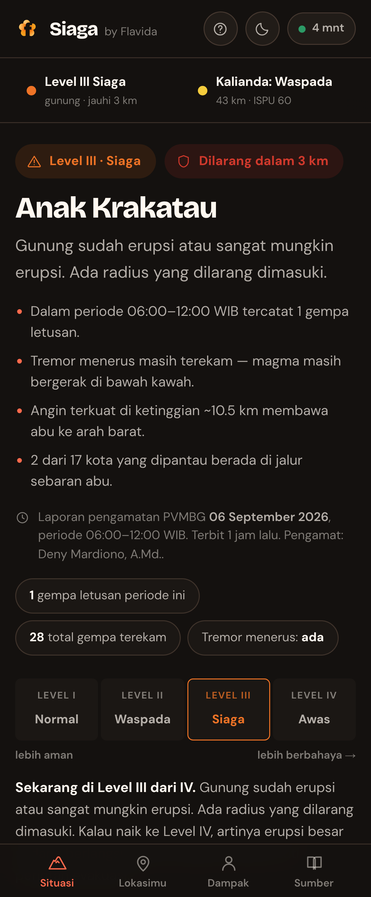 | 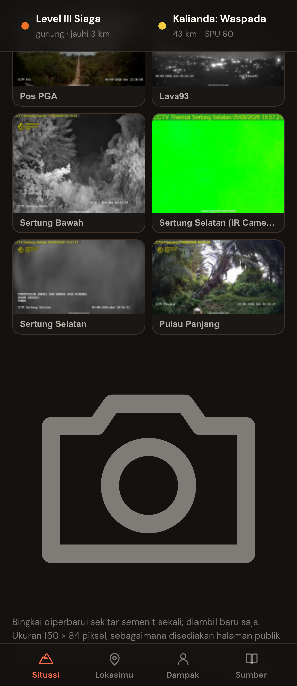 | 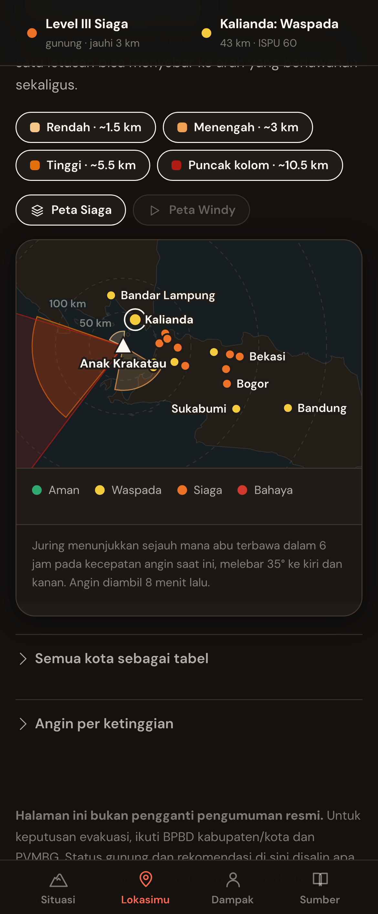 |

| Dampak | Infografis tindakan | Cara pakai |
|---|---|---|
| 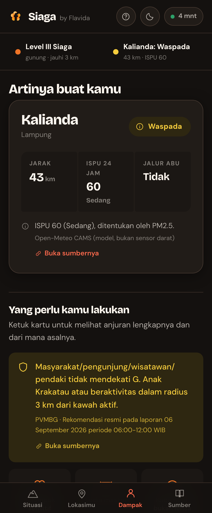 | 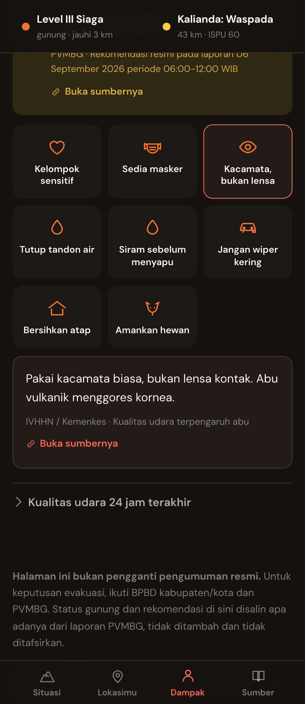 | 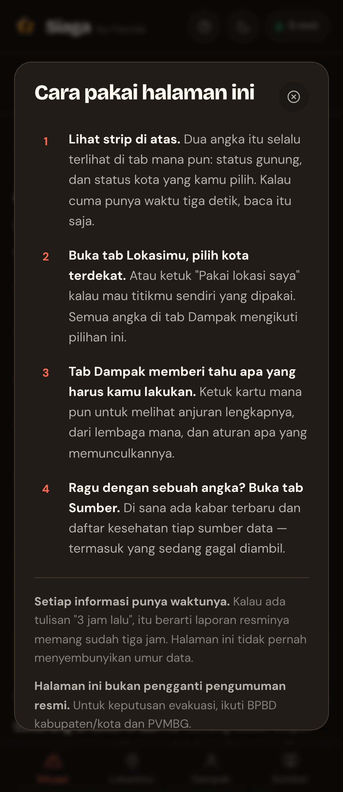 |

**Linimasa sumber.** Satu aliran kronologis, terbaru di atas, dengan gambar sampul dari
umpan penerbit. Tiap butir membawa lencana asalnya: **Resmi** kalau datang dari akun
lembaga, **Berita** kalau liputan media, **Perbincangan** kalau unggahan yang sedang ramai.

| Ponsel | Layar lebar |
|---|---|
| 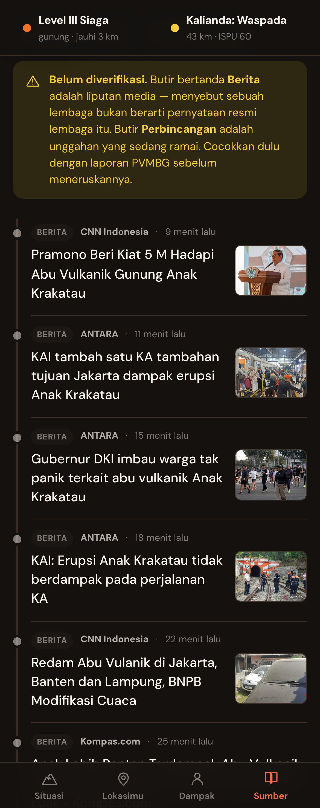 | 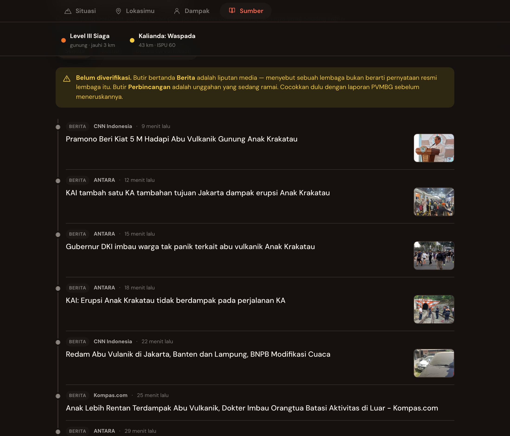 |

**Situasi — layar lebar.** Navigasi naik ke atas, kamera jadi tiga kolom.

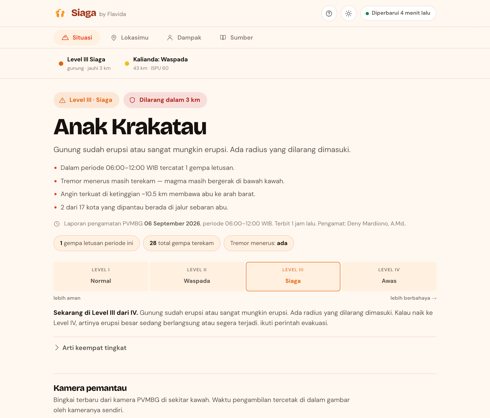

**Peta sebaran abu.** Juring menunjukkan sejauh mana abu terbawa dalam 6 jam pada
kecepatan angin saat itu, melebar 35° ke kiri dan kanan. Empat juring karena arah angin
berbeda di tiap ketinggian — abu di 3 km bisa ke tenggara sementara abu di 10 km ke barat.

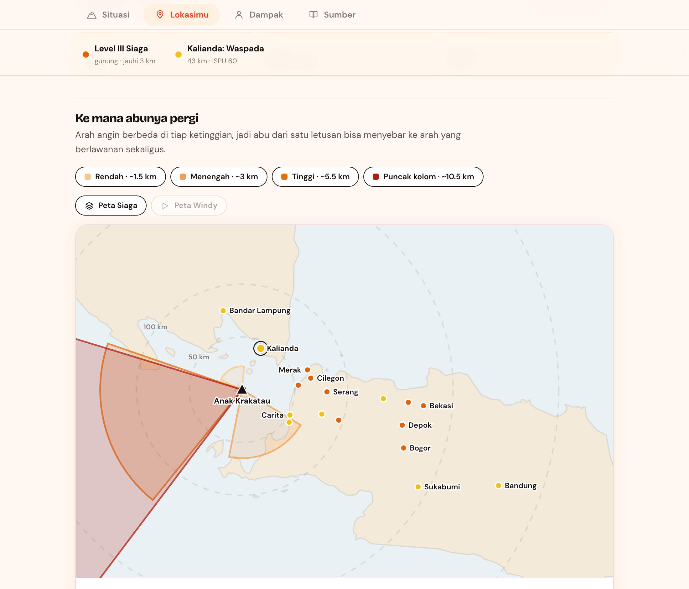

| Kualitas udara 24 jam | Lokasi perangkat |
|---|---|
| 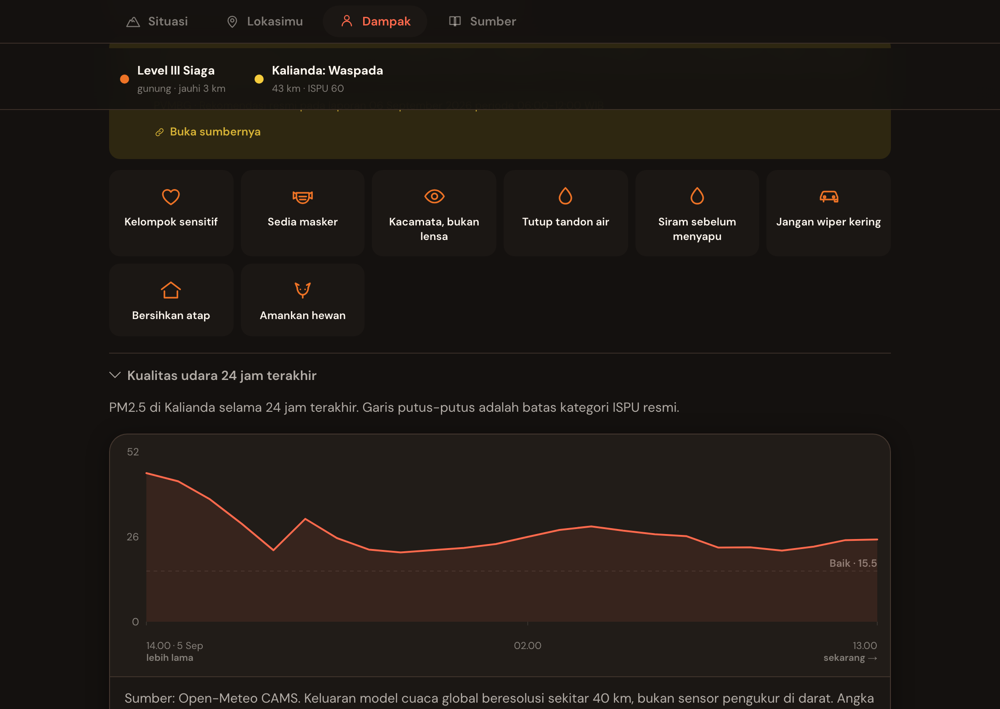 | 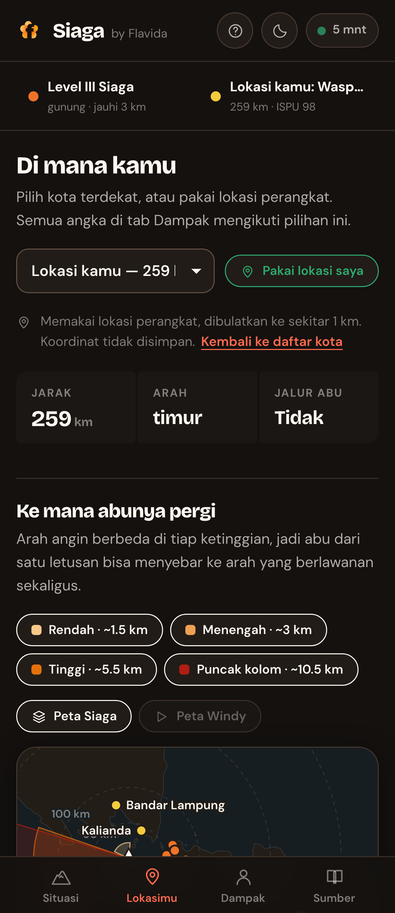 |

Mode terang mengikuti pengaturan perangkat, dan bisa dikunci lewat tombol di kanan atas:

| Terang | Lapisan Windy |
|---|---|
| 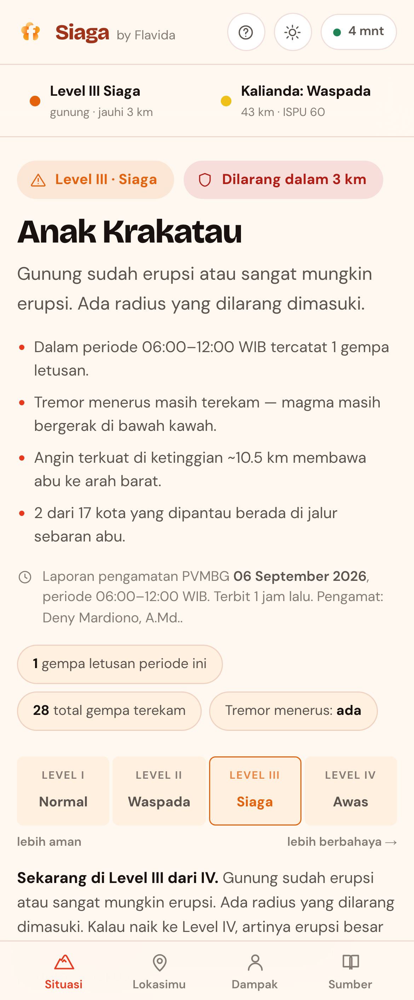 | 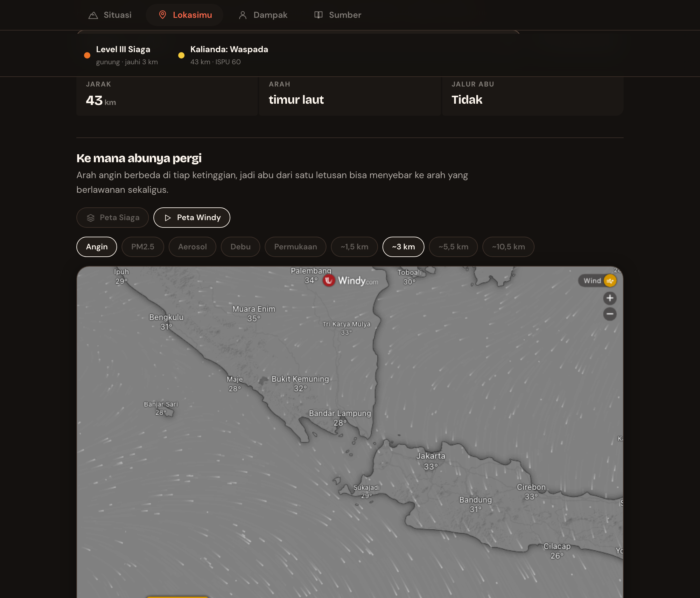 |

## Sumber data

Semua ditarik di sisi server tiap 10 menit. Tidak ada satu pun yang butuh kunci berbayar.

| Sumber | Dipakai untuk | Cara ambil | Status |
|---|---|---|---|
| **MAGMA Indonesia / PVMBG** — [tingkat aktivitas](https://magma.esdm.go.id/v1/gunung-api/tingkat-aktivitas) | Level gunung (I–IV) seluruh gunung api | Baca HTML (server-rendered) | ✅ jalan |
| **MAGMA / PVMBG** — laporan pengamatan 6 jam | Visual, kegempaan per jenis, **rekomendasi resmi**, radius larangan | Baca HTML lewat tautan bertanda tangan dari tabel di atas | ✅ jalan |
| **MAGMA / PVMBG** — laporan harian | Ringkasan harian | Baca HTML | ✅ jalan |
| **MAGMA / PVMBG** — kamera pemantau | 6 kamera di sekitar kawah Anak Krakatau | Baca HTML, bingkai tersemat sebagai JPEG base64 | ✅ jalan |
| **BMKG** — [`autogempa.json`](https://data.bmkg.go.id/DataMKG/TEWS/autogempa.json) dll. | Gempa tektonik (dipisahkan dari gempa vulkanik) | JSON publik | ✅ jalan |
| **Open-Meteo Air Quality (CAMS)** | PM2.5 / PM10 / SO₂ per kota → ISPU | JSON publik | ✅ jalan |
| **Open-Meteo Forecast** | Angin pada 850/700/500/250 hPa di atas kawah | JSON publik | ✅ jalan |
| **Google News RSS (id)** | Jangkauan terluas: kabar dari puluhan media | RSS | ✅ jalan |
| **RSS penerbit** — ANTARA, CNN Indonesia, Tempo | URL artikel asli **dan gambar sampul**, yang tidak diberikan Google News | RSS, gambar dari `enclosure`/`media:content` | ✅ jalan |
| **X** — endpoint sematan `syndication.twitter.com` | **Menemukan** unggahan akun resmi (@infoBMKG, @BNPB_Indonesia, …) | Baca `__NEXT_DATA__` | ⚠️ tergantung reputasi IP |
| **X** — pencarian kata kunci lewat Nitter | **Menemukan** unggahan warga | RSS instans Nitter | ⚠️ perlu whitelist, lihat di bawah |
| **X** — [FxTwitter](https://github.com/FixTweet/FxTwitter) | **Melengkapi** tiap unggahan: teks penuh, foto, video, metrik | `api.fxtwitter.com` | ✅ jalan, tanpa kunci |
| **Threads** | Unggahan warga | Threads Graph API | ❌ perlu App Review Meta — [panduan token](docs/threads.md) |
| **Windy** (opsional, atas persetujuan pembaca) | Lapisan angin / PM2.5 / aerosol di peta | iframe `embed.windy.com` | ✅ jalan |

Yang gagal **tidak disembunyikan**. Bagian "Dari mana datanya" di halaman menampilkan
status tiap sumber berikut pesan errornya, supaya pembaca tidak menganggap halaman
lengkap padahal tidak.

### Catatan jujur soal tiap sumber

**MAGMA tidak punya API publik tanpa token**, jadi halamannya yang dibaca. Kalau tata
letak MAGMA berubah, parser melempar error dan sumbernya ditandai gagal — bukan
menampilkan data lama diam-diam. Kalau pengambilan laporan gagal, halaman memakai
**laporan tersimpan terakhir** dan menyebutkan umurnya secara mencolok, sementara level
gunung tetap diambil dari tabel tingkat aktivitas (halaman terpisah, jadi jarang gagal
bersamaan). MAGMA sesekali membalas 403 saat ramai; ada satu kali coba ulang otomatis.
Kalau kamu punya token API MAGMA, jalur itu lebih stabil dan tinggal ditambahkan di
`src/sumber/magma.js`.

**Open-Meteo CAMS adalah keluaran model global beresolusi sekitar 40 km, bukan sensor
pengukur di darat.** Jakarta dan Bogor sering jatuh di sel model yang sama dan menunjukkan
angka identik. Ini ditulis apa adanya di halaman. Angka resmi ada di stasiun pemantau
KLHK dan BMKG.

**X terbagi dua peran, dan itu penting untuk dipahami:**

*Menemukan* unggahan dan *membaca isinya* adalah dua masalah terpisah. FxTwitter
menyelesaikan yang kedua dengan sangat baik dan gratis, tapi tidak bisa menyelesaikan
yang pertama sama sekali — `/latest`, `/timeline`, dan `/search` semuanya membalas 404.
Jadi ia dipakai sebagai **pelengkap**, bukan penemu.

| Peran | Dikerjakan oleh | Keandalan |
|---|---|---|
| Menemukan unggahan akun resmi | endpoint sematan X | tergantung reputasi IP — sering 429 dari IP pusat data, biasanya lolos dari sambungan rumahan |
| Menemukan unggahan warga | instans Nitter | perlu pembaca RSS di-whitelist |
| Membaca isi unggahan | **FxTwitter** | stabil, tanpa kunci |

Setiap tautan X yang ditemukan dilewatkan ke FxTwitter, sehingga yang tampil di halaman
bukan cuplikan HTML melainkan teks penuh, foto atau video, dan jumlah suka/ulang.

**Kalau penemuan sedang mati sama sekali**, isi `sumberX.postPilihan` di
`config/config.json` dengan tautan unggahan X yang penting — FxTwitter tetap bisa
menariknya. Bawaan repo ini sudah memuat dua pengumuman resmi BMKG untuk erupsi
September 2026 sebagai contoh.

**Saringan relevansi.** Linimasa @infoBMKG berisi laporan gempa otomatis setiap beberapa
menit dari seluruh Indonesia. Tanpa saringan, halaman erupsi Krakatau penuh gempa
magnitudo 2 di Flores. Unggahan media sosial karena itu hanya lolos kalau menyebut
gunung yang dipantau atau kata kunci di `sumberX.kataKunci`. Berita tidak disaring ulang
karena sudah tersaring di kueri pencariannya.

**Nitter:** instans seperti `xcancel.com` mengharuskan pembaca RSS di-whitelist. Panggil
sekali, ambil ID dari pesan errornya di panel "Dari mana datanya", lalu kirim surel ke
alamat yang mereka sebutkan. Daftar instans ada di `config/config.json`.

**Threads:** Meta punya endpoint `keyword_search`, tapi **tanpa persetujuan App Review
untuk izin `threads_keyword_search`, endpoint itu hanya mengembalikan unggahan milik
pemilik token** — bukan unggahan publik. Punya akun Threads saja tidak cukup.
Langkah lengkap mendapatkan tokennya ada di **[docs/threads.md](docs/threads.md)**.

---

## Bagaimana kesimpulannya dihitung

**Tanpa LLM.** Semua status dan rekomendasi keluar dari aturan yang bisa dibaca dan
diperiksa di `src/analisa.js` dan `config/ambang.json`. Setiap langkah yang muncul di
halaman membawa **dasar** (aturan mana yang jalan) dan **sumber** (dari mana angkanya),
yang bisa dibuka pembaca lewat "Kenapa ini muncul".

### Status gunung

Langsung dari **level PVMBG**, tidak ditafsirkan ulang. Halaman menampilkannya sebagai
tangga empat tingkat — makin ke kanan makin berbahaya — dengan tingkat yang sedang
berlaku disorot, arti tingkat berikutnya kalau naik, dan arti keempatnya di balik lipatan.
Tanpa itu, "Level III" tidak memberi tahu apa pun kepada orang yang baru pertama membaca.

| Level | Nama | Artinya |
|---|---|---|
| I | Normal | Tidak ada gejala tekanan magma yang berarti |
| II | Waspada | Aktivitas naik di atas normal, ada potensi erupsi |
| III | Siaga | Gunung sudah erupsi atau sangat mungkin erupsi, ada radius yang dilarang |
| IV | Awas | Erupsi besar sedang berlangsung atau segera terjadi, ikuti perintah evakuasi |

### Status kota

Diambil yang **paling tinggi** dari tiga aturan:

1. **Zona larangan.** Radius dibaca dari teks rekomendasi PVMBG (`radius 3 km`), bukan
   angka karangan. Kota di dalam radius → **bahaya**. Kalau teksnya tidak menyebut radius,
   nilainya `null` dan aturan ini tidak jalan.
2. **Kualitas udara.** ISPU dihitung dari rata-rata bergerak 24 jam PM2.5/PM10/SO₂ dengan
   interpolasi linier antar titik patah **Permen LHK No. P.14/2020**, lalu diambil parameter
   dominan sesuai definisi ISPU. Baik → aman, Sedang → waspada, Tidak Sehat → siaga,
   Sangat Tidak Sehat & Berbahaya → bahaya.
3. **Jalur sebaran abu.** Kota dianggap di jalur kalau arahnya dari kawah berada dalam
   ±35° dari arah tiupan angin **di salah satu lapisan ketinggian** dan jaraknya di bawah
   400 km → minimal **waspada**.

Status gunung dan status kota **tidak dicampur**. Kota 250 km jauhnya dengan udara bersih
tidak jadi "siaga" hanya karena gunungnya Level III.

### Ringkasan situasi

Kalimat pembuka di tab Situasi **dirangkai ulang setiap kali data masuk**, bukan teks
tetap: jumlah gempa letusan periode ini, apakah erupsi menerus sudah berhenti, apakah
tremor masih terekam, ke arah mana angin terkuat membawa abu, dan berapa kota yang berada
di jalur sebarannya. Kalau sebuah angka tidak ada di laporan, kalimatnya tidak dibuat —
bukan diisi tebakan.

### Rekomendasi tindakan

Digabung dari empat asal, semuanya dikutip apa adanya:

- **Rekomendasi resmi PVMBG** dari laporan pengamatan — disalin verbatim, tidak diringkas.
- **Tindakan menurut kategori ISPU** — mengikuti Permen LHK P.14/2020 Lampiran III.
- **Tindakan khas abu vulkanik** — IVHHN dan Kemenkes (masker N95, kacamata bukan lensa
  kontak, tutup penampungan air, siram sebelum menyapu, jangan pakai wiper kering).
- **Aturan zona larangan** kalau kota berada di dalam radius.

Setiap anjuran dan setiap alasan status membawa **tautan rujukan yang bisa dibuka**:
laporan PVMBG yang bersangkutan, teks Permen LHK P.14/2020 di JDIH BPK, panduan IVHHN,
atau dokumentasi Open-Meteo. Tautannya ada di `sumberTautan` pada `config/ambang.json` —
kalau kamu mengubah sebuah ambang, ubah juga rujukannya.

Kalau data sumbernya tidak ada, keluarannya kosong — bukan diisi nilai default yang
kelihatan meyakinkan.

---

## Kamera pemantau

PVMBG memasang enam kamera di sekitar Anak Krakatau: **Pos PGA, Lava93, Sertung Bawah,
Sertung Selatan, Sertung Selatan (IR), dan Pulau Panjang.** Halaman daftar MAGMA
menyematkan bingkai terbaru tiap kamera sebagai JPEG base64, jadi tidak ada yang perlu
ditembus — yang dibaca persis gambar yang MAGMA tampilkan sendiri.

- **Bingkai diperbarui sekitar satu menit sekali.** Waktu pengambilan tercetak di dalam
  gambar oleh kameranya, jadi bisa diperiksa langsung tanpa percaya halaman ini.
- **Ukurannya 150 × 84 piksel** dan itu memang yang disediakan halaman publik. Gambar
  penuh ada di balik endpoint ber-CSRF Laravel dan sengaja tidak diambil.
- **Disajikan dari server sendiri** (`/api/cctv/<n>.jpg`, singgahan 45 detik), supaya
  peramban pembaca tidak menembak MAGMA satu per satu dan tanda tangan URL mereka tidak
  bocor ke klien. Berapa pun jumlah pembaca, MAGMA ditanya paling sering 45 detik sekali.
  Enam permintaan gambar yang berangkat bersamaan **dijaga satu penjaga**, jadi saat
  singgahan kedaluwarsa tetap hanya ada satu pengambilan — bukan enam.
- **Rasio tiap kamera dibaca dari berkas JPEG-nya**, bukan diseragamkan: dua dari enam
  kamera merekam 150 × 113. Bingkai yang gagal dimuat menampilkan keterangan, bukan ikon
  gambar rusak bawaan peramban.
- **Lisensi CC BY-NC-ND 4.0, PVMBG Badan Geologi.** Gambar disajikan apa adanya, tanpa
  modifikasi, dengan atribusi dan tautan balik di bawah setiap grid. Kalau kamu memakai
  proyek ini untuk sesuatu yang komersial, lisensi itu tidak mengizinkannya.

---

## Lokasi perangkat

Tombol **"Pakai lokasi saya"** memakai geolocation peramban untuk mengganti pilihan kota
dengan titik pengguna sendiri, lalu menghitung ulang jarak, arah, ISPU, jalur abu, dan
seluruh daftar tindakan untuk titik itu.

Yang dilakukan supaya ini tidak jadi kebocoran data:

- **Izin tidak pernah diminta saat halaman dibuka.** Pengguna yang menekan tombolnya.
- **Koordinat dibulatkan ke 2 desimal (~1,1 km)** di peramban sebelum dikirim, dan
  dibulatkan lagi di server. Sel model kualitas udara lebarnya sekitar 40 km, jadi
  ketelitian lebih dari itu tidak menambah apa pun selain risiko.
- **Dikirim lewat badan POST, bukan query string**, supaya tidak mendarat di access log,
  riwayat peramban, atau header `Referer`.
- **Tidak disimpan di mana pun** — tidak ke SQLite, tidak ke log. Yang ada hanya singgahan
  di memori selama 10 menit, berkunci koordinat yang sudah dibulatkan, semata supaya
  Open-Meteo tidak ditanya berulang.
- Izin ditolak, perangkat tidak bisa menentukan posisi, atau permintaan kehabisan waktu
  ditangani masing-masing dengan pesan yang menyebutkan apa yang terjadi, lalu halaman
  kembali ke pemilih kota.

Halaman tetap berfungsi penuh tanpa izin lokasi. Fiturnya percepatan, bukan syarat.

---

## Tema

Bawaannya mengikuti pengaturan perangkat (`prefers-color-scheme`). Tombol di kanan atas
memutar tiga keadaan: **ikut perangkat → terang → gelap**, dan pilihannya diingat di
`localStorage`. Tema juga bisa dipaksa lewat `?tema=terang` atau `?tema=gelap` untuk
berbagi tautan atau mengambil tangkapan layar.

Mode gelap bukan pembalikan otomatis: langkah warnanya dipilih ulang untuk latar gelap
dan diuji ulang. Orang memeriksa status gunung jam dua pagi.

Tidak ada kedipan saat halaman dimuat — atribut temanya dipasang oleh skrip kecil di
`<head>` sebelum halaman digambar.

---

## Lapisan Windy

Toggle **"Peta Windy"** menampilkan `embed.windy.com` sebagai pembanding dari model
ECMWF dan CAMS, dengan empat lapisan yang **sudah diuji satu per satu**:

| Lapisan | Kunci overlay | Yang ditampilkan |
|---|---|---|
| Angin | `wind` | arah & kecepatan udara, bisa dipilih ketinggiannya: permukaan, ~1,5 / 3 / 5,5 / 10,5 km — sama dengan lapisan di kompas angin |
| PM2.5 | `pm2p5` | partikel halus, µg/m³ |
| Aerosol | `aod550` | ketebalan optik aerosol — yang paling dekat dengan sebaran abu |
| Debu | `dustsm` | debu permukaan, µg/m³ |

`so2` sengaja tidak dipakai: embed Windy menerimanya tanpa error tapi diam-diam kembali
menggambar lapisan angin, jadi pembaca akan melihat data yang bukan yang diminta.

**Tidak aktif sejak awal, dan meminta persetujuan sekali.** Membuka lapisan ini berarti
peramban pembaca menghubungi windy.com dan alamat IP-nya terlihat oleh mereka. Peta
bawaan Siaga digambar sendiri dan tidak memanggil siapa pun, jadi ia tetap yang utama —
lebih ringan, tetap jalan tanpa internet ke pihak ketiga, dan menampilkan status kota
yang tidak dimiliki Windy. Saat toggle dimatikan, iframe-nya dibuang, bukan disembunyikan.

---

## Arsitektur

```
server.js              satu proses: berkas statis + /api/* + penjadwal
src/
  util.js              ambil HTTP (dengan satu coba ulang), parser HTML, jarak & arah bumi
  analisa.js           mesin aturan: ISPU, radius, jalur abu, status kota, rekomendasi
  db.js                skema SQLite + potret JSON
  kumpul.js            orkestrator: tarik semua sumber, hitung, tulis potret
  sumber/
    magma.js           PVMBG — tingkat aktivitas, laporan 6 jam, laporan harian
    bmkg.js            gempa tektonik
    cuaca.js           Open-Meteo — kualitas udara & angin per lapisan
    publik.js          Google News RSS, X (temu lewat sematan/Nitter, lengkapi lewat FxTwitter), Threads
config/
  config.json          gunung yang dipantau, daftar kota, interval, sumber X
  ambang.json          titik patah ISPU, level PVMBG, teks tindakan — semua bersitasi
public/
  index.html           satu halaman, tanpa langkah build
  gaya.css             token Flavida + palet status
  app.js               peta SVG, kompas angin, grafik — vanilla, tanpa kerangka kerja
  coastline.json       garis pantai Selat Sunda, 7 KB (Natural Earth 10m, disederhanakan)
test.js                25 pemeriksaan mandiri, tanpa framework
scripts/
  tangkap.mjs          tangkapan layar README lewat CDP (alat pengembangan)
  garis-pantai.mjs     buat ulang coastline.json dari Natural Earth (sekali jalan)
docs/threads.md        cara mendapatkan token Threads, berikut batasannya
```

**Cache yang benar.** Halaman induk disajikan `no-cache` **berikut ETag**, aset dipanggil
dengan `?v=…` dan disajikan `immutable` setahun. Tanpa ETag, `no-cache` saja tidak cukup:
peramban tidak punya cara memeriksa kesegaran dan tetap memakai salinan lama — ini pernah
membuat perbaikan halaman tidak sampai ke pembaca selama pengembangan.

**Muat pertama punya percobaan ulang.** Kalau permintaan jatuh tepat saat server sedang
mengumpulkan data (503), halaman mencoba lagi dengan jeda naik bertahap sampai 30 detik
dan menampilkan spanduk yang menyebutkan apa yang terjadi — bukan menggantung sampai
penyegaran lima menit.

**Nol dependensi npm.** Node 25 sudah membawa `fetch`, `node:sqlite`, `node:http`, dan
`WebSocket`. Tidak ada `npm install`, tidak ada rantai pasok yang perlu dijaga, dan
`docker build` hanya menyalin berkas. Halaman juga tanpa kerangka kerja dan tanpa langkah
build — peta dan grafik digambar sebagai SVG langsung.

### Kenapa JSON *dan* SQLite

Pertanyaan yang sering muncul, jadi ditulis alasannya:

- **Potret terkini → satu berkas JSON** (`data/terkini.json`). Dibaca utuh tiap permintaan,
  ditulis atomik lewat rename, dan bertahan saat proses dinyalakan ulang. Untuk data yang
  selalu dibaca seluruhnya, berkas tunggal lebih cepat dan lebih sederhana daripada kueri.
- **Riwayat → SQLite** (`data/siaga.db`). Tumbuh terus dan butuh kueri rentang waktu:
  laporan per periode, deret kualitas udara per kota, unggahan yang sudah pernah terlihat,
  dan riwayat kesehatan sumber. MAGMA hanya menampilkan laporan terbaru, jadi **tren
  kegempaan antar periode hanya ada kalau kita sendiri yang menyimpannya.**

Patokannya sederhana: kalau selalu dibaca utuh dan ukurannya tetap, pakai berkas. Kalau
tumbuh tanpa batas atau perlu disaring per rentang, pakai SQLite. Untuk skala ini,
Postgres tidak memberi apa pun selain satu layanan lagi yang harus dijaga.

---

## Menjalankan di homelab

### Docker Compose (paling ringkas)

```bash
git clone git@github.com:arnantoakbar/siaga.git
cd siaga
docker compose up -d --build
```

Buka `http://<ip-homelab>:8080`. Pengumpulan pertama jalan saat start dan makan sekitar
10–15 detik; sebelum selesai, `/api/terkini` membalas 503 dan halaman menampilkan keadaan
memuat.

```bash
docker compose logs -f siaga     # lihat sumber mana yang jalan / gagal
docker compose restart siaga
```

### Tanpa Docker

```bash
node --version    # butuh 24 atau lebih baru (node:sqlite bawaan)
node server.js
```

### systemd

```ini
# /etc/systemd/system/siaga.service
[Unit]
Description=Siaga
After=network-online.target

[Service]
Type=simple
User=siaga
WorkingDirectory=/opt/siaga
ExecStart=/usr/bin/node server.js
Environment=TZ=Asia/Jakarta
Environment=PORT=8080
Restart=always
RestartSec=10

[Install]
WantedBy=multi-user.target
```

```bash
sudo systemctl enable --now siaga
```

### Di balik reverse proxy

Caddy:

```
siaga.domainkamu.id {
    reverse_proxy localhost:8080
}
```

Nginx:

```nginx
server {
    server_name siaga.domainkamu.id;
    location / {
        proxy_pass http://127.0.0.1:8080;
        proxy_set_header Host $host;
        proxy_set_header X-Forwarded-For $proxy_add_x_forwarded_for;
    }
}
```

Layanan ini tidak butuh basis data eksternal, tidak menyimpan data pengunjung, dan tidak
memasang cookie. Satu-satunya yang disimpan di peramban adalah kota pilihan terakhir di
`localStorage`.

### Variabel lingkungan

| Nama | Bawaan | Arti |
|---|---|---|
| `PORT` | `8080` | Port dengar |
| `INTERVAL_MENIT` | `10` | Selang pengumpulan data |
| `TZ` | `Asia/Jakarta` | Zona waktu proses |
| `THREADS_TOKEN` | — | Token Threads (butuh App Review, lihat di atas) |

### Endpoint

| Endpoint | Isi |
|---|---|
| `GET /api/terkini` | Seluruh potret: status, kota, angin, kabar, kesehatan sumber |
| `GET /api/kesehatan` | Ringkas untuk pemantauan. Balas 503 kalau potret lebih tua dari 3× interval |
| `GET /api/cctv` | Daftar kamera + waktu pengambilan + lisensi |
| `GET /api/cctv/<n>.jpg` | Bingkai terbaru satu kamera |
| `POST /api/lokasi` | Analisa untuk satu titik. Badan `{"lat":-6.92,"lon":107.62}`. Tidak menyimpan apa pun |
| `POST /api/segarkan` | Paksa pengumpulan ulang sekarang |

`/api/kesehatan` cocok dipakai Uptime Kuma atau healthcheck Docker.

---

## Konfigurasi

### Menambah kota

Tambahkan di `config/config.json`. Jarak dan arah dari kawah dihitung sendiri, tidak perlu
diisi:

```json
{ "id": "cilacap", "nama": "Cilacap", "provinsi": "Jawa Tengah", "lat": -7.727, "lon": 109.010 }
```

Kalau kota berada di luar kotak peta, geser `PETA` di `public/app.js` dan buat ulang
`public/coastline.json` dengan `node scripts/garis-pantai.mjs <barat> <selatan> <timur> <utara>`
(sumbernya Natural Earth `ne_10m_land`).

### Memantau gunung lain

Ubah `gunung` di `config/config.json` — `nama` harus persis seperti tertulis di tabel
tingkat aktivitas MAGMA (mis. `"Semeru"`, `"Merapi"`, `"Ibu"`). Sisanya jalan sendiri:
level, laporan, rekomendasi, angin, kualitas udara.

### Menempel unggahan X secara manual

Kalau penemuan otomatis sedang mati, isi `sumberX.postPilihan` di `config/config.json`:

```json
"postPilihan": [
  "https://x.com/infoBMKG/status/2096418871880339807"
]
```

FxTwitter yang mengambil isinya — tanpa kunci, tanpa akun. Kosongkan daftarnya kalau
unggahannya sudah tidak relevan.

### Mengubah ambang

`config/ambang.json` memuat titik patah ISPU, pemetaan level, sektor toleransi sebaran abu,
dan seluruh teks tindakan. Tiap kelompok punya kunci `_sumber` yang menyebutkan asal
aturannya. **Kalau kamu mengubah angka di sini, ubah juga sitasinya** — supaya tidak ada
ambang tanpa dasar.

---

## Uji

```bash
node test.js
```

25 pemeriksaan, tanpa framework, fokus pada logika yang kalau salah membuat orang salah
mengambil keputusan: interpolasi ISPU di tiap titik patah resmi, pembacaan radius larangan
(termasuk kasus "tidak ada radius" yang harus menghasilkan `null`, bukan angka), sektor
sebaran abu saat menyeberang 0°, konversi WIB→UTC, dan satu regresi untuk bug yang pernah
terjadi: footer situs MAGMA sempat terbaca sebagai rekomendasi keselamatan.

---

## Catatan desain

Tampilan memakai **Flavida Design System** — Bricolage Grotesque untuk judul, DM Sans untuk
teks, latar krem, tombol pil, sudut kartu 20 px.

Satu keputusan yang layak dijelaskan: **warna api Flavida tidak dipakai untuk tingkat
bahaya.** Flame `#E8391D` tetap milik elemen interaktif (tautan, tombol, fokus), sementara
tingkat bahaya memakai palet status terpisah hijau → kuning → jingga → merah, mengikuti
kelaziman PVMBG dan ISPU yang sudah dikenal orang Indonesia.

Palet status itu diuji dengan pemeriksa keterbedaan warna, dan hasilnya: **empat warna
hangat berurutan tidak bisa lolos ambang keterbedaan lewat rona saja** — buta warna deutan
tidak bisa memisahkan kuning dari jingga dari merah. Yang menyelamatkan justru beda terang,
dan itu pun tidak cukup untuk dijadikan satu-satunya penanda. Maka aturannya: **status
selalu tampil sebagai warna + label teks + bentuk ikon**, tidak pernah warna saja. Peta
selalu punya padanan tabel. Grafik magnitudo memakai ramp satu rona, bukan skala status.

Mode gelap bukan pembalikan otomatis: langkahnya dipilih ulang untuk latar gelap dan diuji
ulang. Orang memeriksa status gunung jam dua pagi.

---

## Batasan

- **MVP terbatas Anak Krakatau.** Gunung lain bisa dipantau lewat konfigurasi, tapi banjir,
  tanah longsor, dan tsunami belum ada.
- **Kualitas udara adalah keluaran model, bukan pengukuran darat.** Lihat catatan di atas.
- **Sebaran abu adalah perkiraan arah**, bukan prakiraan resmi. Prakiraan resmi ada di VONA
  PVMBG dan Darwin VAAC. VONA belum ditarik karena tabelnya digambar JavaScript.
- **Penemuan unggahan media sosial rapuh, pembacaannya tidak.** FxTwitter stabil untuk
  membaca isi unggahan, tapi menemukan unggahan baru tergantung endpoint sematan X
  (sensitif reputasi IP) atau Nitter (perlu whitelist). Threads terkunci App Review Meta.
  Google News RSS yang paling andal saat ini dan itulah yang mengisi kanal perbincangan.
- **Gambar unggahan X dimuat dari CDN Twitter**, jadi peramban pembaca menghubungi
  `pbs.twimg.com`. Dikirim dengan `referrerpolicy="no-referrer"`.
- **Tidak ada notifikasi.** Halaman ini harus dibuka. Push, SMS, dan siaran WhatsApp adalah
  langkah berikutnya, dan itu yang paling menolong orang yang tidak punya media sosial.

---

## Peringatan

**Halaman ini bukan pengganti pengumuman resmi.** Untuk keputusan evakuasi, ikuti BPBD
kabupaten/kota dan PVMBG. Status gunung dan rekomendasi disalin apa adanya dari laporan
PVMBG — tidak ditambah, tidak ditafsirkan.

Data milik lembaga masing-masing: PVMBG/Badan Geologi KESDM, BMKG, KLHK, Open-Meteo,
dan penerbit berita yang tercantum di tiap tautan.
